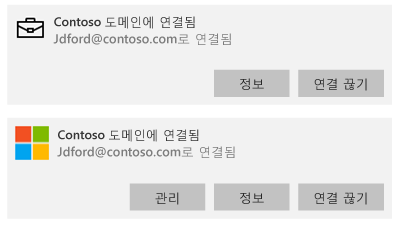
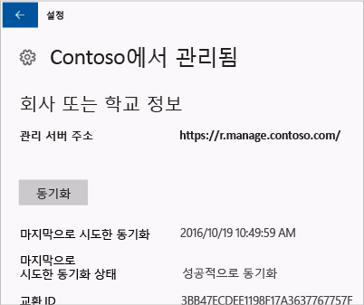
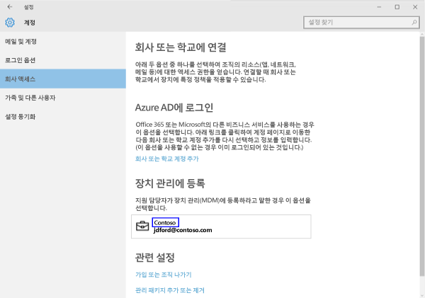
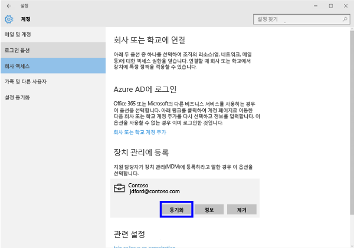
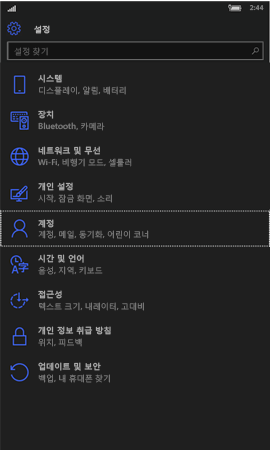
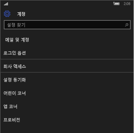
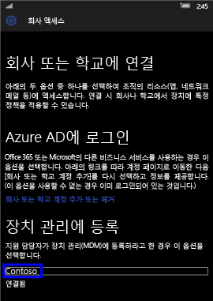
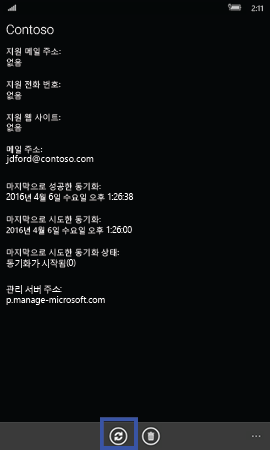
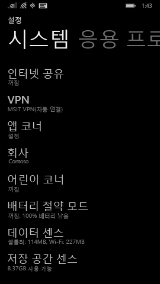
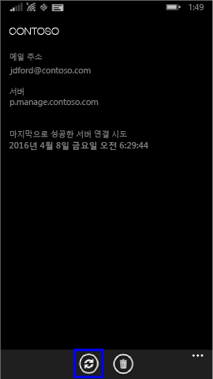

# 수동으로 Windows 장치 동기화

때로 Windows 장치에 앱을 설치하는 것은 생각보다 시간이 오래 걸릴 수 있습니다. 이 경우에 Windows 장치를 수동으로 동기화할 수 있습니다. 동기화하면 설치 속도가 빨라집니다.

> [!Note]
> 속도가 느리거나 동시에 콘텐츠를 다운로드하는 장치가 많은 네트워크에 있는 경우 앱 설치 시간이 조금 걸릴 수 있습니다.

다음 버전의 Windows는 수동으로 동기화할 수 있습니다. 장치가 서로 다른 버전의 Windows를 사용하는 경우 수동 동기화를 시작할 수 없습니다.

* [Windows 10 데스크톱 동기화](#windows-10-desktop)
* [Windows 10 Mobile 동기화](#windows-10-mobile)
* [Windows Phone 8.1 동기화](#windows-phone-81)

## Windows 10 Desktop
Windows 10 버전에는 여러 개가 있으므로 두 가지 방식의 단계가 있습니다. 사용할 단계를 확인하려면 스크린샷을 확인한 후 장치에 표시되는 것과 비슷한 단계를 따릅니다.

1. **시작** 단추를 선택한 다음 **설정**을 선택합니다.

    

2. **설정** 페이지에서 **계정**을 선택합니다.

    

3. 다음의 두 화면 중에서 장치에 표시되는 것과 비슷한 화면을 찾습니다. 장치에 표시되는 화면의 지침을 따릅니다.

    “회사 또는 학교 액세스” 화면이 표시되면 [회사 또는 학교 액세스가 표시되는 경우 따라야 하는 절차](#steps-to-follow-if-you-see-access-work-or-school)의 지침을 따릅니다.

    

    “회사 액세스” 화면이 표시되면 [회사 액세스가 표시되는 경우 따라야 하는 절차](#steps-to-follow-if-you-see-work-access)의 단계를 수행합니다.

    

### 회사 또는 학교 액세스가 표시되는 경우 따라야 하는 절차

1. **계정** 페이지에서 **회사 또는 학교 액세스**를 선택합니다.

    

2. 회사 또는 학교 계정을 선택합니다. 회사 지원팀이 설정한 방법에 따라 아래에 표시된 예제와 같이 두 개의 계정이 표시될 수 있습니다. 한 계정 옆에는 서류 가방이 표시되고 다른 계정 옆에는 Microsoft 로고가 표시됩니다.

    - 서류 가방이 있는 계정이 있으면 해당 계정을 선택하고 **정보** 단추를 찾습니다.
    - Microsoft 로고가 있는 계정만 보이면 해당 계정을 선택하고 아래에 있는 **정보** 단추를 찾습니다.

    

3. **정보** 단추를 선택합니다. 아래 예제와 비슷한 대화 상자가 열립니다.

    

4. **동기화** 단추를 선택합니다. 장치가 Intune과 동기화됩니다.

### 회사 액세스가 표시되는 경우 준수할 절차

1. **계정** 페이지에서 **회사 액세스**를 선택합니다.

    

2. **장치 관리에 등록** 섹션에서 회사 이름을 클릭합니다.

    

3. **동기화** 단추를 선택합니다.

    

   단추는 동기화가 완료될 때까지 회색으로 표시됩니다.

### Windows 10 Mobile
느린 앱 설치 속도를 높이기 위해 Windows 10 모바일 장치를 수동으로 동기화하려면:

   1. **모든 앱** > **설정** > **계정**으로 이동합니다.

       

   2. **회사 액세스**를 선택합니다.

       

   3. **장치 관리에 등록**에서 회사 이름을 탭합니다.

       

   4. **동기화** 아이콘을 선택합니다.

       

       “We’re synching your account(계정을 동기화 중입니다.)”라는 메시지가 화면 맨 위에 표시됩니다. **동기화** 단추는 장치 동기화를 마칠 때까지 회색으로 표시됩니다.

## Windows Phone 8.1
느린 앱 설치 속도를 높이기 위해 Windows Phone 8.1 장치를 수동으로 동기화하려면:

1. **모든 앱** > **설정** > **회사**로 이동합니다.

    

2. 회사 이름을 선택합니다.

    

3. **동기화** 아이콘을 선택합니다.

    

   장치 동기화를 마칠 때까지 “We’re synching your account(계정을 동기화 중입니다.)”라는 메시지가 화면 맨 위에 표시됩니다.

여전히 도움이 필요하세요? 회사 지원 부서에 문의하세요. 연락처 정보는 [회사 포털 웹 사이트](https://portal.manage.microsoft.com#HelpDeskDialog)를 참조하세요.
